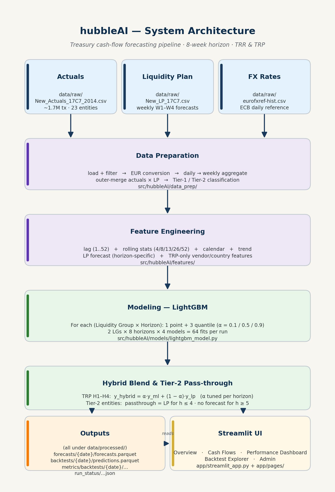
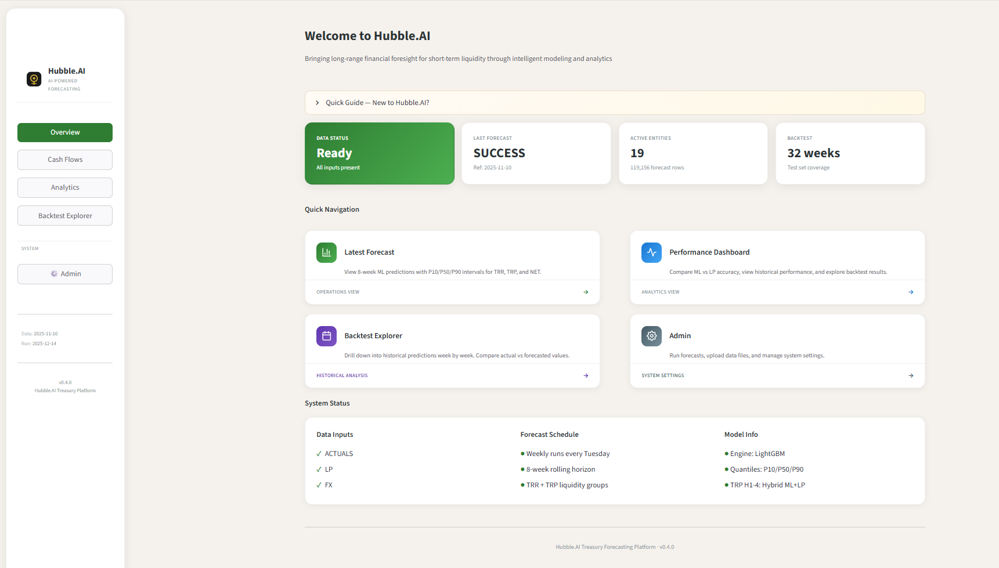
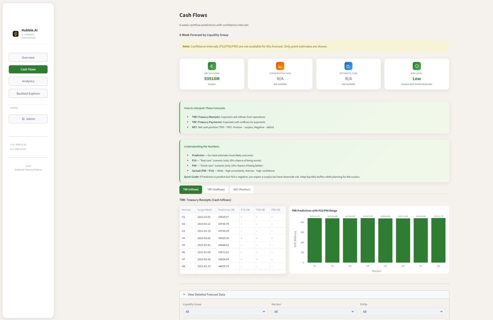
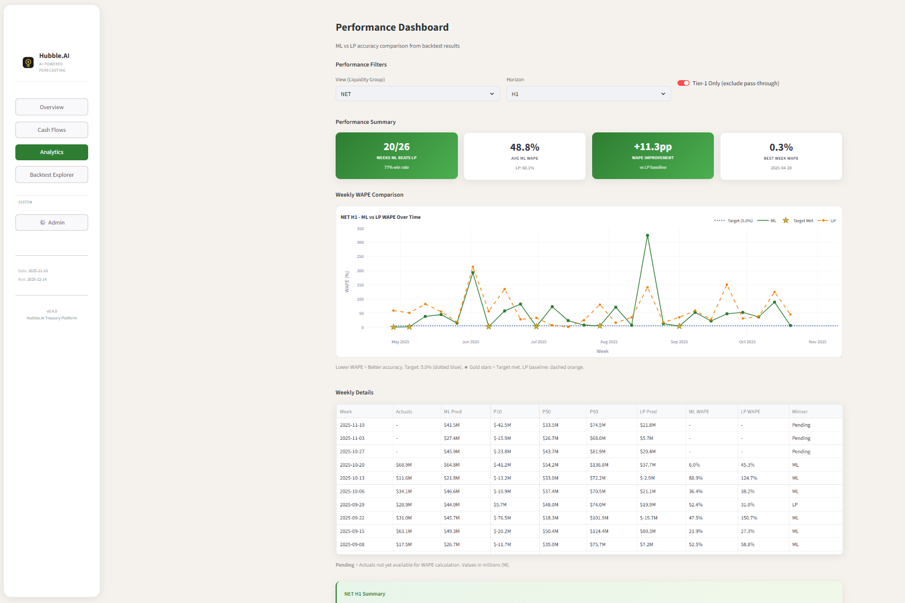
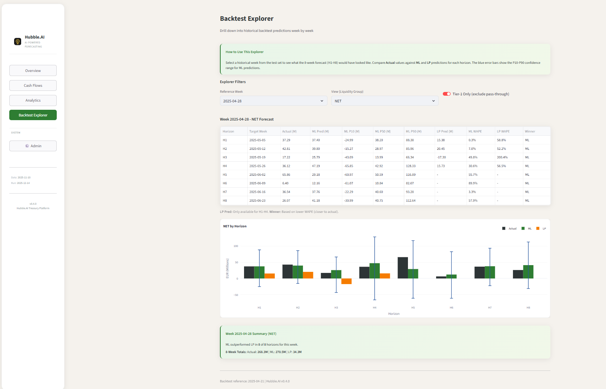
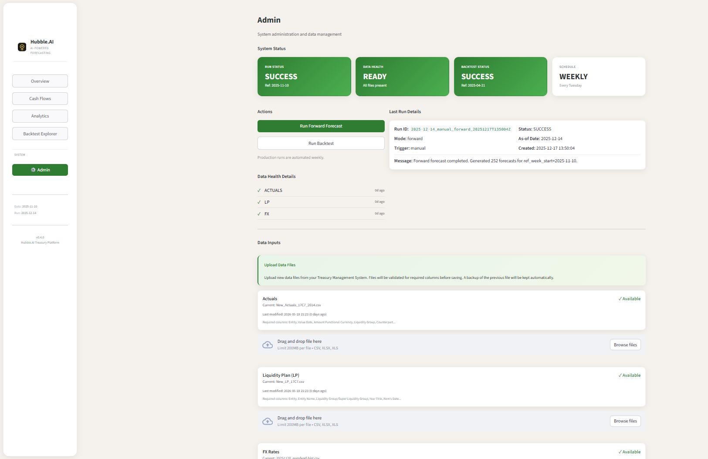
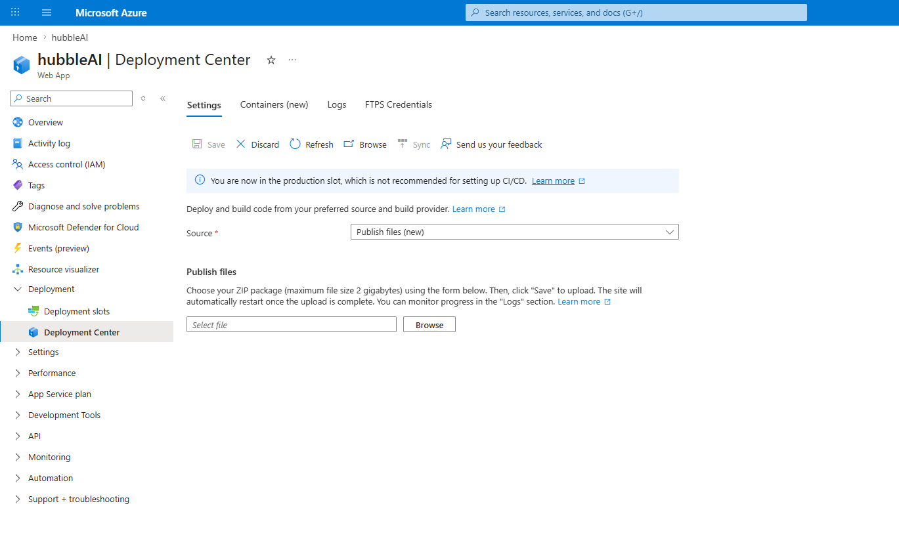

# hubbleAI — System Guide

This is the long-form walkthrough of how hubbleAI works end to end. It assumes you have **not** worked with the codebase before, but that you understand basic Python and what a forecast is. If a technical term appears in **bold-italic** the first time, it's defined in the [Glossary](#20-glossary) at the end.

Every concrete claim about the code points to a `file:line` you can click through.

If you only have 5 minutes, read sections **1**, **2**, **3**, and **18**. If you have an hour, also read **5**, **6**, **9**, **11**, **12.1**, and **15**.

---

## Table of contents

1. [The business problem](#1-the-business-problem)
2. [Why a new system was needed](#2-why-a-new-system-was-needed)
3. [Solution at a glance](#3-solution-at-a-glance)
4. [Repository layout](#4-repository-layout)
5. [Data inputs](#5-data-inputs)
6. [Preprocessing: daily transactions → weekly aggregates](#6-preprocessing-daily-transactions--weekly-aggregates)
7. [Feature engineering](#7-feature-engineering)
8. [Tier-1 / Tier-2 entity classification](#8-tier-1--tier-2-entity-classification)
9. [Modelling approach](#9-modelling-approach)
10. [Quantile predictions: P10 / P50 / P90](#10-quantile-predictions-p10--p50--p90)
11. [Hybrid ML + LP forecasting](#11-hybrid-ml--lp-forecasting)
12. [Backtesting and validation](#12-backtesting-and-validation)
13. [Metrics — what they mean and why we chose them](#13-metrics--what-they-mean-and-why-we-chose-them)
14. [Outputs: what gets saved where](#14-outputs-what-gets-saved-where)
15. [Streamlit UI tour](#15-streamlit-ui-tour)
16. [Azure deployment](#16-azure-deployment)
17. [Minute-by-minute: what happens when someone clicks "Run Forecast"](#17-minute-by-minute-what-happens-when-someone-clicks-run-forecast)
18. [Known gaps and landmines](#18-known-gaps-and-landmines)
19. [V1 → V2 roadmap](#19-v1--v2-roadmap)
20. [Glossary](#20-glossary)

---

## 1. The business problem

Aperam's Treasury team is responsible for knowing how much **cash** the company will receive and pay each week, per **legal entity**, so that the right amount of liquidity is available at the right place. They group every cash event into either:

- **TRR** — *Treasury Receipts*, the money flowing **in** (customer payments, dividends received, intercompany funding inflows).
- **TRP** — *Treasury Payments*, the money flowing **out** (supplier payments, payroll, taxes, intercompany funding outflows).

Treasury planning has traditionally relied on the **Liquidity Plan (LP)** — a manually-prepared forecast that local Treasury / Controllers feed in once a week. The LP only extends **4 weeks** forward (`W1_Forecast` … `W4_Forecast`) and is essentially a bottom-up, human-curated number.

Two practical problems with LP-only planning:

1. **Visibility cap at 4 weeks.** Cash decisions taken 5+ weeks ahead — refinancing windows, dividend timing, hedging notional sizing — have to be made by analogy or rule of thumb. There is no number.
2. **Manual quality drift.** LP accuracy varies by entity, by reviewer, and by month. There is no systematic way to measure whether LP is improving or degrading over time.

## 2. Why a new system was needed

The brief for hubbleAI was to:

- Extend cash-flow visibility from **4 weeks to 8 weeks**.
- Produce a **quantified accuracy signal** — for both the new ML forecast and for the existing LP — so Treasury can see *how good* each method is, week by week.
- Express **uncertainty** explicitly (best case / likely / worst case) rather than a single number.
- Do all of this **per legal entity**, per liquidity group (TRR, TRP), so localised problems are visible.

The system does **not** replace LP. For the first 4 weeks where both signals exist, it consumes LP as one of its inputs and (for TRP) blends the two via a tuned weight. The receiver of the forecast — Treasury — keeps doing what they always did, but with more information.

## 3. Solution at a glance

At a high level:



The whole pipeline runs in a single Python process. There is no separate model server, no database, and no microservice. Outputs are **Parquet files** on disk. The Streamlit app reads those files; it does not call the model directly.

## 4. Repository layout

```text
hubbleAI/
├─ README.md                          ← install + quick start
├─ Claude.md                          ← technical spec aligned with current code
├─ pyproject.toml, requirements.txt   ← Python 3.11
├─ data/
│  ├─ raw/                            ← input CSVs
│  └─ processed/                      ← all outputs (Parquet + JSON)
├─ src/hubbleAI/
│  ├─ config.py                       ← every constant + the Tier-2 list
│  ├─ pipeline.py                     ← the one entry point: run_forecast()
│  ├─ service.py                      ← read-only helpers for the UI
│  ├─ data_prep/                      ← load, FX, aggregate, merge, classify
│  ├─ features/                       ← lag, rolling, calendar, trend, LP
│  ├─ models/lightgbm_model.py        ← point + quantile training/prediction
│  └─ evaluation/metrics.py           ← WAPE, MAE, pinball, hybrid α tuning
├─ app/                               ← Streamlit UI
├─ notebooks/TCF_V2.ipynb             ← original development notebook
├─ tests/test_metrics.py              ← unit tests (metrics module only)
└─ docs/SYSTEM_GUIDE.md               ← this file (with matching .pdf)
```

## 5. Data inputs

The pipeline reads exactly **three CSV files** from `data/raw/`. The filenames are pinned in [config.py:32-34](../src/hubbleAI/config.py#L32-L34):

| File | What it contains | Loaded by |
| --- | --- | --- |
| `New_Actuals_17C7_2014.csv` | Daily transaction-level **actuals** (every cash movement). One row per transaction with `Value Date`, `Entity`, `Liquidity Group`, `Amount Functional Currency`, etc. ~1.7 million rows, 23 entities, 22 raw liquidity groups (only TRR & TRP are kept downstream). Date range: 2014-01-01 → 2025-10-31. | [load_data.load_actuals](../src/hubbleAI/data_prep/load_data.py#L24) |
| `New_LP_17C7.csv` | Weekly **Liquidity Plan** entries, one row per (entity, plan week, week-ahead 1..4) point. ~98k rows. `Year Title` (e.g. `2025/CW45`) identifies the *target* week the forecast is for. | [load_data.load_liquidity_plan](../src/hubbleAI/data_prep/load_data.py#L89) |
| `20251120_eurofxref-hist.csv` | Daily ECB FX reference rates. Used to convert LP amounts in USD or CHF to EUR. | [load_data.load_fx_rates](../src/hubbleAI/data_prep/load_data.py#L153) |

The filenames are taken verbatim from the business-provided extracts. `17C7` is the parent label under which all 23 legal entities are grouped in the source system. The filenames are hard-coded in [config.py:32-34](../src/hubbleAI/config.py#L32-L34) and the Admin upload page ([app/pages/9_Admin.py](../app/pages/9_Admin.py)) writes new uploads to those exact filenames.

The Admin page enforces a **required-columns check** on every upload ([9_Admin.py:76-104](../app/pages/9_Admin.py#L76-L104)). If a future Treasury extract changes column names, the upload will fail loudly rather than silently producing nonsense. There is *no* deeper content validation today (no range checks, no freshness check beyond "does the file exist").

**Data source future state.** [Claude.md §2.8](../Claude.md) anticipates that Actuals and LP will move to **Denodo views**, a direct **Reval** connection, or **Databricks** tables; FX may move to an internal reference system. The `data_prep` module is the only place that touches files today; the rest of the pipeline takes pandas DataFrames as inputs. When the source changes, only `data_prep/load_data.py` needs to change.

## 6. Preprocessing: daily transactions → weekly aggregates

This stage lives entirely in [src/hubbleAI/data_prep/](../src/hubbleAI/data_prep/) and is orchestrated by [`prepare_weekly_data`](../src/hubbleAI/data_prep/prepare.py#L33).

### 6.1 Filtering and entity normalisation

[load_actuals](../src/hubbleAI/data_prep/load_data.py#L24) and [load_liquidity_plan](../src/hubbleAI/data_prep/load_data.py#L89) both:

- Apply small entity-code rewrites (`57 → 057`, `10H2 → 14C1`, `10G6 → 17C7`) so historical entity codes line up with current ones.
- Keep only **TRR** and **TRP** rows; everything else (`OTR`, `OTP`, `FEE`, etc.) is dropped.
- Coerce dates with `pd.to_datetime(..., errors="coerce")` so malformed dates become NaT rather than crashing.

### 6.2 FX conversion

LP entries can be in USD, CHF or EUR. [`convert_lp_to_eur`](../src/hubbleAI/data_prep/fx_conversion.py#L67) replaces every non-EUR amount with its EUR equivalent at the rate of the LP entry's `Item's Date`. If that exact date isn't in the FX file (weekends, holidays), it walks backwards one day at a time until it finds one. After conversion, LP is pivoted to a wide format with `W1_Forecast` … `W4_Forecast` columns plus availability flags.

### 6.3 Daily → weekly aggregation

The actuals file has one row per cash transaction, often dozens per day per entity. We need one row per *(entity, liquidity_group, week_start)*. [`aggregate_actuals_weekly`](../src/hubbleAI/data_prep/aggregation.py#L13) does the sum:

- `week_start` is the **Monday** of the ISO week containing each `Value Date` — *always a Monday*, by construction at [aggregation.py:33-40](../src/hubbleAI/data_prep/aggregation.py#L33-L40).
- `total_amount_week = Σ (Amount Functional Currency)` for that (entity, LG, week).
- Eight calendar flags are derived from the week start: does the week contain the 1st, the 15th, the 20th, the 10th, the end of the month, the middle of the month, or a "cluster" of days near end-of-month / beginning-of-month? These end up as features.

### 6.4 TRP-only granular features

For TRP only (i.e. *payments*), [`build_trp_weekly_features`](../src/hubbleAI/data_prep/aggregation.py#L163) builds five additional per-week aggregates from the transaction-level data:

| Feature | Meaning |
| --- | --- |
| `trp_vendor_count` | Number of distinct counterparts paid that week |
| `trp_top_vendor_share` | Share of the week's absolute payments going to the single biggest vendor |
| `trp_country_count` | Number of distinct counterpart countries |
| `trp_top_country_share` | Share of payments going to the single biggest country |
| `trp_reconciled_share` | Share of payments with status "Reconciled" |

These attempt to capture concentration / structure of the payment week. TRR doesn't have analogous features — the receipts side is dominated by a small number of customers and intercompany flows where these aggregates are less informative.

### 6.5 Aligning LP rows on week_start

This is the subtlest step. The LP file has one row per `Year_Title` (e.g. `2025/CW45`) with four future-looking columns `W1_Forecast` … `W4_Forecast`. **`Year_Title` is the Monday of the week being forecast as W1.** To use LP as a feature, I need the LP row keyed on the **week-of-creation** Monday, not the forecast-target Monday. So [prepare.py:75-76](../src/hubbleAI/data_prep/prepare.py#L75-L76) shifts:

```python
lp_wide["week_start"] = lp_wide["Year_Title"].apply(yearweek_to_monday)
lp_wide["week_start"] = pd.to_datetime(lp_wide["week_start"]) - pd.Timedelta(days=7)
```

After this shift, when we join LP on `(entity, liquidity_group, week_start)`, the W1_Forecast on the row for week *t* is the LP's forecast for the actuals that will be observed in week *t* + 1. W2 in week *t* + 2, etc. The target columns `y_h{h}` (built later at [prepare.py:222-224](../src/hubbleAI/data_prep/prepare.py#L222-L224)) use the same convention via `.shift(-h)`, so the alignment is consistent.

### 6.6 The actuals × LP outer join

[prepare.py:96-100](../src/hubbleAI/data_prep/prepare.py#L96-L100) does an **outer** merge of weekly actuals with the wide LP table on `(entity, liquidity_group, week_start)`. The outer join is deliberate: LP rows that don't have matching actuals (because they predict future weeks) survive the join. `total_amount_week` is then filled with `0` on LP-only rows ([prepare.py:104](../src/hubbleAI/data_prep/prepare.py#L104)). Calendar flags are recomputed for those rows since they can be derived purely from `week_start`.

### 6.7 Targets

[`add_target_columns`](../src/hubbleAI/data_prep/prepare.py#L203) creates eight target columns: `y_h1`, `y_h2`, …, `y_h8`. The target for week *t* horizon *h* is the actual cash amount observed in week *t* + *h*, implemented as `groupby(...).shift(-h)`. So the row for week *t* has, alongside its features, the answer for what will actually happen in weeks *t*+1, *t*+2, …, *t*+8 — these are what the models learn to predict.

## 7. Feature engineering

[`build_all_features`](../src/hubbleAI/features/builder.py#L27) chains five feature-engineering steps. Every step is grouped by `(entity, liquidity_group)` so an entity's history never leaks into another entity's features. Every step that uses past values uses **`.shift(1)`** before any rolling window so the *current* week's value is never part of its own feature.

### 7.1 Lag features

[`add_lag_features`](../src/hubbleAI/features/lag_features.py#L14) creates `lag_1w_total`, `lag_2w_total`, …, `lag_52w_total` — i.e. for week *t*, the value of `total_amount_week` at *t*−1, *t*−2, …, *t*−52. **52 columns.**

> *Why 52?* Treasury data exhibits both monthly (e.g. payroll, taxes, VAT) and yearly seasonality. Year-over-year comparison needs a full-year lag, hence 52.

### 7.2 Rolling features

[`add_rolling_features`](../src/hubbleAI/features/rolling_features.py#L15) computes seven statistics (mean, std, sum, min, max, median, coefficient of variation) over five window sizes (4, 8, 13, 26, 52 weeks). The `shift(1)` is applied first so the current week is excluded. **35 columns.**

### 7.3 Calendar features

[`add_calendar_features`](../src/hubbleAI/features/calendar_features.py#L10) extracts year, month, quarter, ISO week number, and four boolean flags (is quarter start / end / year start / end) from `week_start`. Plus the eight calendar flags already built during weekly aggregation. **15-ish columns** in total.

> *Why both calendar features here and during aggregation?* History: the aggregation step needs the calendar flags to flag whether the original *daily* dates inside the week hit those days. The duplicated calendar features here add a few derivatives the aggregation didn't produce (year, quarter, etc.).

### 7.4 Trend features

[`add_trend_features`](../src/hubbleAI/features/trend_features.py#L15) fits a simple least-squares slope `y ~ x` over rolling windows of 12 and 26 weeks (with `shift(1)` so the current week isn't included). Additionally produces a "12-week acceleration" — the week-over-week change in the 12-week slope. **3 columns.**

### 7.5 LP-accuracy features (intentionally excluded from the final feature set)

[`add_lp_accuracy_features`](../src/hubbleAI/features/lp_features.py#L56) produces 16 columns capturing how well LP forecasted past weeks: per-horizon error, absolute error, rolling 12-week bias, and rolling 12-week MAE. These were built and analysed during the exploratory phase, but were **deliberately dropped from the final feature set** — they are strongly correlated with the LP forecast columns (`W{h}_Forecast`) that the model already sees, so including them did not add information and risked making the model harder to interpret. The drop happens via [`DROP_COLS`](../src/hubbleAI/config.py#L125-L140), which [`get_base_feature_cols`](../src/hubbleAI/features/builder.py#L64) excludes before training. The function is still invoked because the columns are useful for offline / notebook analysis.

### 7.6 Horizon-specific LP feature injection

Up to this point, the feature set is **identical for every horizon**. The one place we vary inputs by horizon is the LP feature itself — at training time, for each horizon *h* in 1..4, we inject **exactly one** LP column `W{h}_Forecast`. For *h* in 5..8 we inject **none** (no LP exists that far out).

This is done in [`get_feature_cols_for_horizon`](../src/hubbleAI/features/lp_features.py#L21):

```python
cols = list(base_feature_cols)
lp_col = LP_FORECAST_COLS.get(horizon)     # 1→W1_Forecast, 2→W2_Forecast, ...
if lp_col is not None and (all_cols is None or lp_col in all_cols):
    cols.append(lp_col)
return cols
```

> *Why one column not four?* Each `W{h}_Forecast` is the LP's prediction for a specific future week. If you pass all four to the model for every horizon, the model can find spurious associations (e.g. using W3 to predict h=1). Forcing one-to-one alignment per horizon is a regularising constraint that mirrors the business logic.

## 8. Tier-1 / Tier-2 entity classification

Not every (entity, liquidity_group) pair has enough clean history to support ML. The system splits them into two tiers and treats them differently.

**Tier-2** entities have any of these properties:

1. They appear in the hard-coded list [`TIER2_LIST`](../src/hubbleAI/config.py#L65) (10 pairs today — entities the Treasury team flagged as having unreliable history).
2. Their entire history of `total_amount_week` sums to zero — i.e. no actuals were ever observed for this combination. [prepare.py:154-163](../src/hubbleAI/data_prep/prepare.py#L154-L163) calls this the **dynamic tier-2** set.

Tier-2 forecasts are not produced by ML — they are **LP passthroughs**: for horizons 1..4, the forecast value is simply `W{h}_Forecast`; for horizons 5..8 the forecast is undefined (no LP exists). The passthrough rows still appear in the output Parquet, but with `is_pass_through = True` and `model_type = "lp_passthrough"`.

**Tier-1** entities are everything else — and are further filtered to those with **at least 52 weeks of history** ([prepare.filter_tier1_with_history](../src/hubbleAI/data_prep/prepare.py#L183), where 52 is [`MIN_HISTORY_WEEKS`](../src/hubbleAI/config.py#L94)).

In the latest backtest (Apr–Nov 2025), the Tier-1 set has ~15 entities × 2 LGs and the Tier-2 set has ~5–6 entities × 1–2 LGs.

> *Why the 52-week threshold?* The features include 52-week lags and 52-week rolling windows. Below 52 weeks, those features would be all-NaN and the model would have nothing useful for that entity.

## 9. Modelling approach

### 9.1 Algorithm: LightGBM

V1 uses **LightGBM** ([lightgbm-docs](https://lightgbm.readthedocs.io)), a gradient-boosted decision tree library, as the only learner. The default hyper-parameters live in [config.py:150-161](../src/hubbleAI/config.py#L150-L161):

```python
DEFAULT_LGBM_PARAMS = {
    "objective": "regression",
    "metric": "mae",
    "learning_rate": 0.05,
    "num_leaves": 31,
    "feature_fraction": 0.9,
    "bagging_fraction": 0.8,
    "bagging_freq": 5,
    "min_data_in_leaf": 50,
    "lambda_l2": 1.0,
    "verbosity": -1,
}
NUM_BOOST_ROUND       = 2000   # max boosting iterations
EARLY_STOPPING_ROUNDS = 50     # stop if valid metric hasn't improved in N rounds
```

> *Why LightGBM?* Multiple algorithm families were tested during the exploratory phase — linear models, tree ensembles, and a few sequence-model variants — and LightGBM came out as the most performant for this data on the chosen accuracy targets. It also handles non-linear interactions natively, doesn't require feature scaling, is robust to occasional missing values, and trains fast enough for a full-pipeline re-run on every forecast cycle.

XGBoost is mentioned as a "future option" in [Claude.md](../Claude.md) but **not implemented**. LSTM and SARIMAX are mentioned as "future ideas" but **not implemented**. The `requirements.txt` explicitly notes those are not part of V1.

### 9.2 Strategy: direct multi-horizon

There are two common approaches to multi-step forecasting:

- **Recursive.** Train one model that predicts one step ahead, then feed its prediction back in to predict the next step, and so on. Simple, but errors compound.
- **Direct.** Train a separate model for each horizon. More models to manage, but each one is optimised for exactly the prediction it makes.

V1 uses the **direct** strategy. [pipeline.py:338-349](../src/hubbleAI/pipeline.py#L338-L349) loops over `(liquidity_group, horizon)` and trains a model for each combination. With 2 LGs × 8 horizons × (1 point + 3 quantile) = **64 LightGBM fits per pipeline run**.

> *Why direct, not recursive?* Aperam's data does not satisfy the smoothness assumptions that make recursive strategies attractive. Weekly cash flows are spiky, often non-stationary, and influenced by month-end / quarter-end calendar effects that are different at horizon 1 (where you may already see them in lags) vs horizon 8 (where they're far in the future). A separate model per horizon means H8 is allowed to look very different from H1.

### 9.3 Train / validation / test split

Forward and backtest modes use the same time-based split — first 85 % of unique weeks for **train**, next 10 % for **valid**, last 5 % for **test** — implemented by two functions that compute the same boundaries:

- **`assign_split`** ([lightgbm_model.py:61](../src/hubbleAI/models/lightgbm_model.py#L61)) — used in **forward** mode.
- **`_assign_backtest_split`** ([pipeline.py:245](../src/hubbleAI/pipeline.py#L245)) — used in **backtest** mode.

Both modes also use the same training filter — rows where `split ∈ {train, valid}` *and* the target column is not NaN — so for every (LG, horizon) the **training set is identical** in the two modes. The difference is purely in what each mode does after fitting:

- **Forward** predicts only for `ref_week_start` (today's Monday) and writes a forecast file. No metrics.
- **Backtest** predicts for every row in the test split, compares against known actuals, and writes the full metrics / diagnostics grid.

This means the backtest's WAPE numbers are a meaningful proxy for the forward model's accuracy — the two models are fit on the same data and (modulo LightGBM's bagging / column-subsampling randomness — there's no `seed` set) produce essentially the same booster.

### 9.4 Training a single (LG × horizon) model

[`train_lgbm_model`](../src/hubbleAI/models/lightgbm_model.py#L96) is the core trainer. Given the prepared feature DataFrame and a target column:

1. Build feature column list via `get_feature_cols_for_horizon(horizon, base_feature_cols)`.
2. For TRP, additionally inject the five TRP-only columns from [`TRP_EXTRA_FEATURES`](../src/hubbleAI/config.py#L100).
3. Drop rows where the target is NaN.
4. Split into `train_df` and `valid_df` using the `split` column.
5. Wrap into `lgb.Dataset` objects and call `lgb.train` with early stopping (50-round patience on the validation metric, MAE).
6. Return the fitted Booster plus validation MAE / RMSE / WAPE.

The quantile variant ([`train_lgbm_quantile_model`](../src/hubbleAI/models/lightgbm_model.py#L180)) is identical except `objective = "quantile"`, `alpha = 0.10 / 0.50 / 0.90`, and `metric = "quantile"`.

> *No models are persisted to disk.* Every pipeline run re-trains all 64 models from scratch. Training takes on the order of a few minutes locally; this is acceptable today but is a known target for V2 (save Boosters as `.txt` or `.pkl`, version-tag them, and just predict on subsequent runs).

## 10. Quantile predictions: P10 / P50 / P90

For each (LG, horizon, entity, week) the pipeline produces **four** numbers:

| Column | What it is |
| --- | --- |
| `y_pred_point` | Standard regression-objective LightGBM prediction (minimises MAE) |
| `y_pred_p10` | LightGBM with quantile objective at α=0.10 → "only 10% chance the actual is below this" |
| `y_pred_p50` | Quantile model at α=0.50 → the **median** |
| `y_pred_p90` | Quantile model at α=0.90 → "only 10% chance the actual is above this" |

**Important: the point prediction is not equal to P50.** They come from different models trained with different loss functions. The point model minimises mean absolute error; the P50 model minimises pinball loss at α=0.50. They are usually close but never identical.

> *Why three quantiles, not five (P5/P25/P50/P75/P95) or one?* Three quantiles give the UI enough material to draw a meaningful uncertainty band (P10–P90) while staying within the 64-model budget. Adding more would multiply training cost without adding much business signal.

The quantile models share **everything** with the point model — same features, same train/valid split, same hyper-parameters apart from `objective` and `alpha`. The only thing that varies is the loss function.

> *Tier-2 has no quantiles.* For Tier-2 (LP passthrough) rows, `y_pred_p10/p50/p90` are written as NaN because LP has no notion of uncertainty bands. [pipeline.py:1038-1040,1117-1119](../src/hubbleAI/pipeline.py#L1038-L1040)

## 11. Hybrid ML + LP forecasting

For TRP horizons 1–4 — and *only* there — the pipeline produces a third forecast: the **hybrid**, which is a weighted average of the ML point prediction and the LP forecast.

```
y_hybrid = α · y_ml + (1 − α) · y_lp
```

`α` is **per-horizon** — there's a separate α for TRP H1, TRP H2, TRP H3, TRP H4. For TRR and for TRP H5–H8, α is fixed at 1.0 (pure ML).

### 11.1 Why hybrid, and only for TRP?

The original analysis found a clear pattern:

- **For TRR** (receipts), the ML model outperforms LP on the majority of weeks across all horizons. Pure ML wins; no blending needed.
- **For TRP** (payments), LP is harder to beat because Treasury's local controllers have visible-to-them information about specific payment runs (payroll dates, supplier batches) that the ML model cannot see from history alone. The ML still wins many weeks, but on the weeks where LP wins, it can win convincingly. **A blended forecast captures some of LP's local-knowledge signal while still benefiting from ML's pattern recognition.**

### 11.2 How α is chosen

[`tune_hybrid_alpha`](../src/hubbleAI/evaluation/metrics.py#L1387) implements the tuning. The procedure for each (LG, horizon) in {TRP H1, TRP H2, TRP H3, TRP H4}:

1. For each candidate α in [0.0, 0.1, 0.2, …, 1.0], compute the **weekly win-rate vs LP** — on what fraction of weeks does the hybrid (with this α) have a smaller weekly WAPE than pure LP?
2. Pick the α with the highest win-rate.
3. If even the best α achieves less than 50 % wins, **fall back to α = 0** (pure LP — never do worse than the baseline).

For TRR and TRP H5–H8, the function records α = 1.0 without searching.

In the latest backtest, all four TRP H1–H4 cells converged on **α = 0.1** — i.e. the model leans heavily on LP but takes a small correction from ML. The resulting win-rates were 57 / 63 / 54 / 72% for H1 / H2 / H3 / H4.

> **Note.** α is searched on the same test rows that are then used to report hybrid performance. The intent is to identify the best per-horizon blend for the most recent window. The underlying ML predictions are themselves out-of-sample (the model was trained on weeks before the test split); only the blending weight is fit on the test rows. Forward mode loads the most recently tuned α from the latest backtest and uses it as a fixed input, so forward production forecasts use a pre-determined α.

### 11.3 How α flows back into forward mode

[`load_latest_alpha_mapping`](../src/hubbleAI/pipeline.py#L60) scans `data/processed/metrics/backtests/` for the most recent `alpha_by_lg_horizon.parquet`, reads it, and returns a `{(LG, horizon): α}` dictionary. Forward mode applies this mapping at [pipeline.py:436-446](../src/hubbleAI/pipeline.py#L436-L446):

```python
alpha = alpha_mapping.get((lg, horizon), 1.0)
if alpha == 1.0 or np.all(np.isnan(lp_values)):
    output["y_pred_hybrid"] = predictions             # pure ML
else:
    hybrid = alpha * predictions + (1 - alpha) * lp_values
    hybrid = np.where(np.isnan(lp_values), predictions, hybrid)
    output["y_pred_hybrid"] = hybrid
```

If no backtest has ever been run, the dict is empty and forward defaults to α=1.0 (pure ML).

## 12. Backtesting and validation

A **backtest** is a run of the pipeline in evaluation mode: train on the older 85%+10%, predict on the last 5%, and compare predictions to known actuals.

The backtest is launched from the Admin page's "Run Backtest" button, or programmatically via `run_forecast(mode="backtest")`. Its main differences vs forward mode:

| Aspect | Forward | Backtest |
| --- | --- | --- |
| Predictions written for | Only `ref_week_start` (today's Monday) | All weeks in the test split (~32 weeks in the latest run) |
| `actual_value` column | NaN (future not yet observed) | Filled in (we *know* what happened) |
| α used for hybrid | Loaded from previous backtest | **Tuned on the test split itself** |
| Metric files produced | None | LG / Entity / Net WAPE + diagnostics + α table |
| Output location | `data/processed/forecasts/{date}/forecasts.parquet` | `data/processed/backtests/{date}/backtest_predictions.parquet` + `data/processed/metrics/backtests/{date}/...` |

In the latest backtest run (`ref_week_start = 2025-04-21`), the test split spans **32 unique weeks**, the test set has 7,827 (entity × LG × week × horizon) prediction rows, and 14 metric / diagnostic Parquet files are produced.

> *Note on `ref_week_start` in backtest mode.* Backtest's `ref_week_start` is the last Monday of the validation slice, computed at [pipeline.py:1279-1285](../src/hubbleAI/pipeline.py#L1279-L1285). It's a label that says "this backtest was done with data up to here". It doesn't change what the model trained on.

### 12.1 Latest backtest — headline performance

These are *per-week win rates against the LP baseline*, taken from [alpha_by_lg_horizon.parquet](../data/processed/metrics/backtests/2025-04-21/alpha_by_lg_horizon.parquet) of the most recent backtest:

| Group / horizon | Strategy used | Per-week win rate vs LP | Total weeks |
| --- | --- | --- | --- |
| TRR H1 | Pure ML (α=1.0) | **71 %** | 28 |
| TRR H2 | Pure ML | **74 %** | 27 |
| TRR H3 | Pure ML | **88 %** | 26 |
| TRR H4 | Pure ML | **84 %** | 25 |
| TRP H1 | Hybrid (α=0.1) | **57 %** | 28 |
| TRP H2 | Hybrid (α=0.1) | **63 %** | 27 |
| TRP H3 | Hybrid (α=0.1) | **54 %** | 26 |
| TRP H4 | Hybrid (α=0.1) | **72 %** | 25 |
| TRR / TRP H5–H8 | Pure ML | — (no LP baseline exists to compare) | — |

Two things worth knowing about these numbers:

1. **"Win rate" is a per-week comparison, not average error.** For TRR, ML wins most weeks; on the weeks it *does* lose, it can lose harder than usual — so the average-WAPE figures in [alpha_by_lg_horizon.parquet](../data/processed/metrics/backtests/2025-04-21/alpha_by_lg_horizon.parquet) can look worse for ML than for LP even though the model wins the majority of weeks. Treasury picked per-week win-rate as the primary KPI because it's what they live with operationally.
2. **The hybrid blend α is tuned on the same test rows it is then evaluated on.** I did this deliberately — I wanted the best per-horizon α for the most recent window. The win-rate numbers for TRP are therefore in-sample for the blending weight (the underlying ML predictions are out-of-sample; the model was trained on weeks before the test split). Forward mode loads this α as a fixed input, so production forecasts use a pre-determined α. See [metrics.py:1387-1572](../src/hubbleAI/evaluation/metrics.py#L1387-L1572) and [pipeline.py:666-699](../src/hubbleAI/pipeline.py#L666-L699).

## 13. Metrics — what they mean and why we chose them

The codebase computes a lot of metrics. The two you'll see most are **WAPE** and **per-week win-rate vs LP**.

### 13.1 WAPE (Weighted Absolute Percentage Error)

WAPE answers: *"of the total cash that moved, what fraction did we get wrong?"*

There are two variants in the code, and the distinction matters.

**Standard WAPE** ([metrics.wape](../src/hubbleAI/evaluation/metrics.py#L29)):

```
WAPE = Σ |actual − pred|  ÷  Σ |actual|
```

This treats each row's error as positive and sums them. If predictions are *symmetrically wrong* (some over, some under), this WAPE will be larger than the aggregate-WAPE below.

**Aggregate-then-error WAPE** ([metrics.wape_aggregate](../src/hubbleAI/evaluation/metrics.py#L46)):

```
WAPE = | Σ actual − Σ pred |  ÷  | Σ actual |
```

Here we sum the actuals across all entities in the group first, sum the predictions first, then compute one error on the totals. Over-predictions on one entity *cancel* under-predictions on another.

The pipeline computes **aggregate-then-error** WAPE at the LG and Net levels ([metrics.compute_metrics_by_lg](../src/hubbleAI/evaluation/metrics.py#L354), [metrics.compute_metrics_net](../src/hubbleAI/evaluation/metrics.py#L489)), because **Treasury cares about the total cash position**, not individual-entity perfection. If Entity A is +€10M wrong and Entity B is −€10M wrong, Treasury's total cash is correct, and that's what matters for liquidity planning.

> *Why both definitions exist in code.* The model itself trains against MAE (mean absolute error), which is conceptually the "standard" WAPE numerator. But for reporting we want the aggregate view. Hence both are kept. The eps (zero-denominator guard) is different between the two paths — see §18.2.

### 13.2 Per-week win-rate

For each test week, compute WAPE for ML and WAPE for LP. ML *wins* that week if `wape_ml < wape_lp`. Repeat over all weeks; the win-rate is `wins / total_weeks`. This is the headline metric Treasury cares about because it maps directly to operational experience ("did the model help me this week or not?").

### 13.3 Other metrics computed

The backtest also produces a wider set of diagnostics under `data/processed/metrics/backtests/{date}/diagnostics/`:

| File | What it tells you |
| --- | --- |
| `metrics_horizon_profiles.parquet` | WAPE/MAE/RMSE per horizon — does accuracy decay smoothly as horizon grows, or is there a cliff? |
| `residual_diagnostics.parquet` | Distribution of `actual − pred` per (LG, horizon) — mean, median, std, p10, p25, p75, p90. Look for systematic bias (non-zero mean residual). |
| `entity_stability.parquet` | Per-entity rolling-4-week volatility of error. Identifies entities whose forecast quality jumps around. |
| `model_vs_lp_wins.parquet` | Per-observation win counts (ML wins on this row if `|ml_error| < |lp_error|`). **Different from the per-week win-rate** — this is at the entity-row level, which is a stricter test. |
| `quantile_coverage_by_horizon.parquet` | What fraction of actuals actually fell below P10 / between P10 and P90 / above P90 — calibration check. A well-calibrated P10/P90 should bracket ~80% of actuals. |
| `pinball_by_horizon.parquet` | Pinball loss per quantile — direct measure of quantile prediction quality. |

The Streamlit **Performance Dashboard** displays the headline `metrics_by_lg_clean` (Tier-1 only) and the calibration table. The other diagnostics are written to disk for ad-hoc analysis but are not surfaced in the UI today.

### 13.4 WAPE accuracy targets

The UI shows per-horizon WAPE targets:

| Horizon | Target |
| --- | --- |
| H1 | 5.0% |
| H2 | 7.5% |
| H3 | 10.0% |
| H4 | 12.5% |
| H5 | 15.0% |
| H6 | 17.5% |
| H7 | 20.0% |
| H8 | 22.5% |

These come from Treasury and are hard-coded in two places: [streamlit_app.py:317-325](../app/streamlit_app.py#L317-L325) and [2_Performance_Dashboard.py:108-117](../app/pages/2_Performance_Dashboard.py#L108-L117). They should logically live in `config.py`; that's a known cleanup item.

## 14. Outputs: what gets saved where

Everything the pipeline writes is in `data/processed/`. Outputs are versioned by `ref_week_start` (a date string).

```text
data/processed/
├─ forecasts/                                ← FORWARD outputs
│  └─ 2025-10-27/forecasts.parquet           (~248 rows)
│
├─ backtests/                                ← BACKTEST predictions
│  └─ 2025-04-21/backtest_predictions.parquet   (~7,800 rows)
│
├─ metrics/backtests/                        ← BACKTEST metrics
│  └─ 2025-04-21/
│      ├─ metrics_by_lg.parquet              (full, includes Tier-2)
│      ├─ metrics_by_lg_clean.parquet        (Tier-1 only)
│      ├─ metrics_by_entity.parquet
│      ├─ metrics_net.parquet                (TRR + TRP combined)
│      ├─ metrics_net_clean.parquet
│      ├─ metrics_net_entity.parquet
│      ├─ alpha_by_lg_horizon.parquet        ← α values used for hybrid
│      ├─ weekly_hybrid_breakdown.parquet
│      └─ diagnostics/
│          ├─ metrics_horizon_profiles.parquet
│          ├─ residual_diagnostics.parquet
│          ├─ entity_stability.parquet
│          ├─ model_vs_lp_wins.parquet
│          ├─ quantile_coverage_by_horizon.parquet
│          ├─ quantile_coverage_by_lg_horizon.parquet
│          ├─ pinball_by_horizon.parquet
│          └─ pinball_by_lg_horizon.parquet
│
└─ run_status/                                ← one JSON per run
   ├─ run_status_2025-12-10_manual_forward_...json
   ├─ run_status_2025-12-15_manual_backtest_...json
   └─ latest_run_status.json                  (text pointer to latest)
```

The output schema for `forecasts.parquet` (forward mode) is documented in [config.py:175-189](../src/hubbleAI/config.py#L175-L189). For backtests, the schema has two extra columns: `actual_value` and `lp_baseline_point`. Backtest also adds `y_pred_hybrid` (forward mode doesn't have a "hybrid baseline" because the actual hasn't happened yet, but it still writes the hybrid prediction itself).

The Streamlit app discovers outputs by scanning these directories — see [service.load_latest_forward_forecast](../src/hubbleAI/service.py#L143) and [service.load_latest_backtest_results](../src/hubbleAI/service.py#L196).

## 15. Streamlit UI tour

The UI lives entirely in `app/`. Pages are auto-discovered by Streamlit from the `app/pages/` directory.

### 15.1 Overview (home)



[app/streamlit_app.py](../app/streamlit_app.py). Four KPI cards:

- **Data Status** — whether the three raw CSVs are present.
- **Last Forecast** — date of the most recent forward run.
- **Active Entities** — count of unique entities in the latest forecast.
- **Backtest** — number of test weeks covered.

Then a "Quick Guide" expander introducing WAPE, ML vs LP, P10/P50/P90, and the accuracy targets table. Plus four nav cards linking to Cash Flows, Performance Dashboard, Backtest Explorer, and Admin.

### 15.2 Cash Flows



[app/pages/1_Latest_Forecast.py](../app/pages/1_Latest_Forecast.py). Three tabs: **TRR (Inflows)**, **TRP (Outflows)**, **NET (Position)**. Each tab shows:

- A horizon table H1 → H8 with the point prediction, P10, P50, P90.
- A bar chart of point predictions with P10/P90 error bars.
- For NET: a dynamic "Outlook Summary" with conservative-case / optimistic-case framing.

Below the tabs is a "Detailed Forecast Data" expander with row-level filtering.

### 15.3 Performance Dashboard



[app/pages/2_Performance_Dashboard.py](../app/pages/2_Performance_Dashboard.py). Reads the latest backtest's metric files.

- Filters at the top: View (TRR / TRP / NET), Horizon (H1-H8), Tier-1-only toggle.
- Four KPI cards: ML wins / total weeks, average ML WAPE, improvement vs LP in percentage points, best-week WAPE.
- Main chart: weekly WAPE for ML vs LP over time, with target line and gold-star markers for weeks where ML beat the target.
- Weekly comparison table with actuals, ML/LP predictions, and per-week winner.
- Quantile calibration table at the bottom — verifies P10/P90 bracketing.

### 15.4 Backtest Explorer



[app/pages/3_Backtest_Explorer.py](../app/pages/3_Backtest_Explorer.py). Drill-down view: pick a single historical week from the test set and see what the 8-week forecast made *from that week* would have looked like (H1 → H8 actual vs ML vs LP). Useful for explaining "why did the model do well / poorly on that specific Tuesday".

### 15.5 Admin



[app/pages/9_Admin.py](../app/pages/9_Admin.py). The only **write-capable** page.

- "Run Forward Forecast" button — calls `run_forecast(mode="forward")` synchronously.
- "Run Backtest" button — calls `run_forecast(mode="backtest")` synchronously.
- File upload widgets for Actuals / LP / FX — validates required columns, writes the upload to `data/raw/`, makes a `.backup` of the previous version.
- "Restore Previous Files" — single-level rollback.

> Both Run buttons run the pipeline **in-process**. The UI will appear frozen for a few minutes while the 64 models train. There is no progress indicator beyond a spinner. This is acceptable for V1's single-user expected pattern.

## 16. Azure deployment

V1 lives in a single **Azure App Service** Web App running Python with Streamlit. Deployment is intentionally simple — zip the repo and upload via the Portal. No IaC, no CI/CD, no Dockerfile, no scheduler.

### 16.1 What's deployed

| Item | Value |
| --- | --- |
| App Service name | `hubbleAI` |
| Resource group | `ape.sb.ai.tcff.rg` |
| Subscription | `ape.sb.ai.tcff` |
| Region | `West Europe` |
| Runtime stack | Python 3.11 |
| Publishing model | Code (source-based zip deploy) |
| Public URL | `https://hubbleai-fubzhub0aahkc4hr.westeurope-01.azurewebsites.net` |

### 16.2 Required App Service configuration

Set under *App Service → Configuration*. These already exist in the running app; you only need to revisit them if you recreate the App Service from scratch or a deploy starts misbehaving.

**General settings:** Stack = Python 3.11; **Always On = On**; HTTPS Only = On; **Web sockets = On** (Streamlit needs them); Startup Command =

```
python -m streamlit run app/streamlit_app.py --server.port=$PORT --server.address=0.0.0.0 --server.enableCORS=false --server.enableXsrfProtection=false --server.headless=true
```

**Application settings (env vars):**

| Setting | Value | Purpose |
| --- | --- | --- |
| `SCM_DO_BUILD_DURING_DEPLOYMENT` | `true` | Run `pip install -r requirements.txt` on every zip-deploy. |
| `PYTHONUNBUFFERED` | `1` | Stream logs in real time. |
| `WEBSITES_CONTAINER_START_TIME_LIMIT` | `1800` | Raise container start timeout above the 230 s default — pip-installing LightGBM can exceed it. |
| `WEBSITE_HTTP_RESPONSE_TIMEOUT_SECONDS` | `600` | The "Run Forecast" button takes 2–5 min; without this the HTTP response is cut before the run finishes. |

### 16.3 How to redeploy — Deployment Center → Publish files



This is the path I use day-to-day.

1. Build the zip from a clean local checkout:

   ```powershell
   Remove-Item -Recurse -Force .venv, __pycache__ -ErrorAction SilentlyContinue
   Compress-Archive `
       -Path .\app, .\src, .\data, .\notebooks, .\tests, .\docs, .\README.md, .\Claude.md, .\pyproject.toml, .\requirements.txt `
       -DestinationPath .\hubbleAI_deploy.zip `
       -Force
   ```

   Zip ends up ~50–150 MB depending on how much of `data/processed/` you include.
2. Open the [Azure Portal](https://portal.azure.com) → **`hubbleAI`** App Service → **Deployment → Deployment Center**.
3. On the **Settings** tab, set **Source** = `Publish files (new)`.
4. In the **Publish files** section, click **Browse**, pick `hubbleAI_deploy.zip` (Portal accepts up to 2 GB), then click **Save** in the top toolbar.
5. The site auto-restarts; pip installs `requirements.txt` (because `SCM_DO_BUILD_DURING_DEPLOYMENT=true`).
6. Watch the **Logs** tab until the latest entry is `Success`. End-to-end: 3–5 minutes.

### 16.4 Updating data files

Two paths. The day-to-day one is the Streamlit Admin page — three drag-and-drop widgets validate required columns, save a `.backup` of the previous file, and replace the live file. No Portal access required.

For files too large for browser upload, or when the Admin page is unavailable: Portal → **`hubbleAI`** → **Development Tools → Advanced Tools → Go** (Kudu) → **Debug console → CMD** → navigate to `/home/site/wwwroot/data/raw/` and drop the file. Restart the App Service afterwards.

### 16.5 Three concerns to be aware of

1. **App Service file system isn't guaranteed durable across restarts.** Outputs written to `data/processed/` may vanish unless you mount Azure Files / Blob Storage to `/home/site/wwwroot/data/processed/`. This is the single biggest V2 decision.
2. **No scheduler exists.** The "every Tuesday" automation the UI references doesn't actually run — forecasts only happen when a human clicks Admin. Options for V2: Azure Function (Timer trigger), App Service WebJob, GitHub Action cron.
3. **No application-level authentication.** Anyone who reaches the URL can read forecasts and click "Run Forecast" / upload data. Mitigate by enabling **App Service → Authentication → Easy Auth → Azure AD → Restrict to organisation** (no code changes needed).

## 17. Minute-by-minute: what happens when someone clicks "Run Forecast"

Suppose a Treasury analyst opens the Streamlit UI, navigates to **Admin**, and clicks "Run Forward Forecast". Here is what happens, end-to-end, with file:line citations.

1. **Click handler.** [9_Admin.py:275-286](../app/pages/9_Admin.py#L275-L286) calls `run_forecast(mode="forward", trigger_source="manual")` synchronously inside the Streamlit request thread.
2. **Entry.** [pipeline.run_forecast](../src/hubbleAI/pipeline.py#L1162). Computes `as_of_date = today − 3 days` (default).
3. **Availability check.** [pipeline.check_data_availability](../src/hubbleAI/pipeline.py#L164) verifies the three raw files exist. If any are missing, the run aborts with `status="data_missing"`; the UI shows an error.
4. **Generate run_id.** Stamp the run with `{as_of_date}_{trigger}_{mode}_{utc_timestamp}`.
5. **Load + prepare.** [pipeline._load_and_prepare_data](../src/hubbleAI/pipeline.py#L195) calls [prepare.prepare_weekly_data](../src/hubbleAI/data_prep/prepare.py#L33):
   - [load_actuals](../src/hubbleAI/data_prep/load_data.py#L24) reads the 1.7M-row actuals CSV (~5 sec).
   - [load_liquidity_plan](../src/hubbleAI/data_prep/load_data.py#L89) reads the LP CSV.
   - [load_fx_rates](../src/hubbleAI/data_prep/load_data.py#L153) reads the FX CSV.
   - [aggregate_actuals_weekly](../src/hubbleAI/data_prep/aggregation.py#L13) groups by (entity, LG, week) → weekly totals.
   - [build_trp_weekly_features](../src/hubbleAI/data_prep/aggregation.py#L163) adds TRP-specific aggregates.
   - [convert_lp_to_eur](../src/hubbleAI/data_prep/fx_conversion.py#L67) walks every LP row, looks up the FX rate for its date, converts to EUR.
   - LP `week_start` is shifted back by 7 days (§6.5).
   - Outer merge of actuals × LP (§6.6).
   - Calendar flags computed; history-weeks counter built.
   - Tier-2 classification: union of `TIER2_LIST` and dynamic-tier-2 (§8).
6. **Features.** [features.build_all_features](../src/hubbleAI/features/builder.py#L27) adds the lag / rolling / calendar / trend / LP-accuracy features (§7).
7. **Targets.** [prepare.add_target_columns](../src/hubbleAI/data_prep/prepare.py#L203) adds `y_h1`…`y_h8`.
8. **Compute `ref_week_start`.** The most recent Monday in the prepared dataset, [pipeline.py:220-228](../src/hubbleAI/pipeline.py#L220-L228).
9. **Filter Tier-1.** [prepare.filter_tier1_with_history](../src/hubbleAI/data_prep/prepare.py#L183) keeps entities with ≥52 weeks of history.
10. **Load α mapping** from the most recent backtest, via [pipeline.load_latest_alpha_mapping](../src/hubbleAI/pipeline.py#L60). If no backtest exists, defaults to α=1.0 (pure ML) for everyone.
11. **The model loop.** [pipeline._build_and_run_models_forward](../src/hubbleAI/pipeline.py#L285):

```
for LG in [TRR, TRP]:
    for horizon in [1..8]:
        feature_cols = get_feature_cols_for_horizon(horizon, base_cols)
        (+ TRP-extras if LG == TRP)
        target = "y_h" + horizon
        df_train = rows where target is not NaN
        # Train 4 models on the same data:
        model_point = train_lgbm_model(df_train, feature_cols, target)
        model_q10   = train_lgbm_quantile_model(..., alpha=0.10)
        model_q50   = train_lgbm_quantile_model(..., alpha=0.50)
        model_q90   = train_lgbm_quantile_model(..., alpha=0.90)
        # Predict only for the rows at ref_week_start:
        df_ref = rows where week_start == ref_week_start
        y_point = model_point.predict(df_ref)
        y_p10   = model_q10.predict(df_ref)
        y_p50   = model_q50.predict(df_ref)
        y_p90   = model_q90.predict(df_ref)
        # Apply hybrid blend:
        α = alpha_mapping.get((LG, horizon), 1.0)
        # If α==1 or LP is NaN: y_hybrid = y_point
        # otherwise:            y_hybrid = α·y_point + (1−α)·W{h}_Forecast
        append rows to all_forecasts
```

12. **Tier-2 passthrough.** [pipeline._build_tier2_passthrough_forward](../src/hubbleAI/pipeline.py#L987) writes one row per (Tier-2 entity, LG, horizon ∈ 1..4) with `y_pred_point = y_pred_hybrid = W{h}_Forecast` and `model_type = "lp_passthrough"`.
13. **Concatenate & save.** All rows merged into one DataFrame, schema enforced via [config.FORECAST_OUTPUT_COLS](../src/hubbleAI/config.py#L175). Saved to `data/processed/forecasts/{ref_week_start}/forecasts.parquet`.
14. **Persist run status.** [pipeline._save_run_status](../src/hubbleAI/pipeline.py#L1131) writes a JSON run-status file plus updates `latest_run_status.json` to point at it.
15. **Return.** The Admin page calls `st.success("Forecast completed!")` and then `st.rerun()` to refresh the UI; the Cash Flows page picks up the new file the next time it's opened.

End-to-end wall-clock time on a local machine: **~2–5 minutes**, dominated by the 64 LightGBM fits. Most of the data-prep / feature-engineering time is the row-wise FX conversion in `convert_lp_to_eur` ([fx_conversion.py:83-85](../src/hubbleAI/data_prep/fx_conversion.py#L83-L85)) — that's a known optimisation target for V2.

## 18. Known gaps and landmines

These are the places where the code looks ready but isn't, or where my docs have drifted from the code. None are blockers for running V1, but you'll hit at least one of them in your first week. This list is exhaustive; nothing below is hidden anywhere else.

### 18.1 Operational / deployment gaps

- **No scheduler exists.** The Streamlit UI displays "Weekly runs every Tuesday" ([streamlit_app.py:671](../app/streamlit_app.py#L671), [9_Admin.py:259-263](../app/pages/9_Admin.py#L259-L263)) — that is *intent*, not current state. Forecasts run only when a human clicks the Admin button. V2 options: Azure Function (Timer trigger), App Service WebJob, GitHub Action cron.
- **No CI/CD, no Dockerfile, no IaC.** Today's deployment workflow is "zip the repo, upload via the Portal's Deployment Center → Publish files" (see §16.3). Feel free to design something more robust.
- **Outputs are written to the App Service file system.** [pipeline.py:1266](../src/hubbleAI/pipeline.py#L1266) and the Admin file-upload flow ([9_Admin.py:147-156](../app/pages/9_Admin.py#L147-L156)) write to local `data/processed/`. Azure App Service file storage is *not* guaranteed to persist across restarts unless you mount Azure Files / Blob Storage. This is the single biggest deployment concern; flagged again in the deployment runbook.
- **Email alerts on data-missing runs are described in [Claude.md](../Claude.md) but not implemented.** [check_data_availability](../src/hubbleAI/pipeline.py#L164-L192) only checks whether the three input CSV files exist on disk; it does not validate freshness, content, or send any notifications.

### 18.2 Code-quality landmines

- **Orphan model-training functions** in [lightgbm_model.py:255-360](../src/hubbleAI/models/lightgbm_model.py#L255-L360): `train_models_for_lg_horizon` and `generate_predictions_for_lg_horizon` are never called (verified by repo-wide grep). The latter contains `# TODO: implement proper quantile models … output["y_pred_p10/p50/p90"] = np.nan` — if someone mistakenly uses this entry point, they will silently get NaN quantiles. The functions are safe today because the live pipeline calls `train_lgbm_model` / `train_lgbm_quantile_model` directly. Worth deleting (or moving to a `src/hubbleAI/future/` directory) once you're comfortable with the codebase.
- **`add_lp_accuracy_features` runs but its columns are intentionally excluded from the model.** [lp_features.py:56-113](../src/hubbleAI/features/lp_features.py#L56-L113) writes 16 LP-accuracy columns (`lp_W{h}_error`, `lp_W{h}_abs_error`, `lp_W{h}_bias_12w`, `lp_W{h}_mae_12w`) which are then listed in [config.py:125-140 DROP_COLS](../src/hubbleAI/config.py#L125-L140). The exclusion is deliberate: those features are strongly correlated with the LP forecast columns the model already sees, so they didn't add information during exploratory testing. The function is still invoked because the columns are useful in the notebook for offline analysis. Worth knowing if you ever wonder why these columns exist on disk but not in the model.
- **Six WAPE implementations.** WAPE is reimplemented in [metrics.py:29,46,68,90](../src/hubbleAI/evaluation/metrics.py#L29), [lightgbm_model.py:25](../src/hubbleAI/models/lightgbm_model.py#L25), [ui_components.py:1151](../app/ui_components.py#L1151), and inline in [service.py:864,968](../src/hubbleAI/service.py#L864). Their ε (zero-denominator) handling is inconsistent: most use `1e-6` (numeric safety), the UI/service uses €500 000 (business threshold for "undefined"). The hybrid-α average-WAPE columns in [alpha_by_lg_horizon.parquet](../data/processed/metrics/backtests/2025-04-21/alpha_by_lg_horizon.parquet) (values around 10¹²) are inflated by near-zero-actuals weeks because they use the `1e-6` path. The *per-week-win-rate* metric in the same file is fine because it's a comparison, not an average. The UI WAPE charts use the €500 000 threshold and are sane. Worth consolidating into one helper in `metrics.py` with a single configurable ε.
- **Two `ForecastRunStatus` dataclasses** exist: [pipeline.py:108-142](../src/hubbleAI/pipeline.py#L108-L142) (the writer) and [service.py:444-487](../src/hubbleAI/service.py#L444-L487) (the reader). They overlap but are not identical; JSON serialisation works today because the reader has `from_dict` with extra defaults. Fragile if either side adds a required field.
- **Hardcoded WAPE targets in two places.** [streamlit_app.py:317-325](../app/streamlit_app.py#L317-L325) (inline HTML) and [2_Performance_Dashboard.py:108-117](../app/pages/2_Performance_Dashboard.py#L108-L117) (Python dict). Should move to `config.py`. Same story for `WAPE_EPS_THRESHOLD = 500_000` in [service.py:441](../src/hubbleAI/service.py#L441) and [ui_components.py:29](../app/ui_components.py#L29).
- **`TIER2_LIST` contains phantom entries.** [config.py:65-75](../src/hubbleAI/config.py#L65-L75) includes `(17C7, TRR)`, `(82J, TRR)` and a few others that have **zero rows in the data**, so the entries are silently no-ops. Not a bug; just clutter.

### 18.3 Modelling decisions worth knowing

- **Hybrid α is in-sample on the test split** (see §12.1 note #2 above). [pipeline.py:666-699](../src/hubbleAI/pipeline.py#L666-L699).
- **`Year_Title` on the LP file** is the Monday of the week being forecast as W1. The pipeline subtracts 7 days to get the "as-of" Monday and joins the LP row to the right feature week. The shift is correct but uncommented at [prepare.py:75-76](../src/hubbleAI/data_prep/prepare.py#L75-L76); worth a one-line comment in V2.

### 18.4 Test coverage

- **Tests cover ~6 % of source LOC.** Only [tests/test_metrics.py](../tests/test_metrics.py) (199 lines, 23 tests), all using synthetic in-memory data. No integration tests for `run_forecast`, no tests for feature engineering, no tests for the LP join / cut-off discipline, no tests for the Streamlit pages. A good place to start growing coverage is the data-prep and feature modules.

## 19. V1 → V2 roadmap

These are *suggestions ordered by likely value*, not commitments.

1. **Automate weekly runs.** Today there is no scheduler. The simplest implementation is an Azure Function (Timer trigger every Tuesday) that calls `run_forecast` and stashes the resulting JSON status to Blob Storage where the UI can read it. Mid-effort.
2. **Make outputs durable.** Mount Azure Files or Blob Storage to `data/processed/` so that App Service restarts don't lose forecast history. Low effort but needs an infra decision.
3. **Persist models.** Stop retraining 64 LightGBM models on every forward run. Save Boosters as `.txt` (LightGBM's native format), version with the run-id, and just predict on subsequent runs. Re-train weekly on the scheduler. Significant speed win.
4. **Optionally split α tuning across validation and test slices.** Today α is tuned on the same test slice that hybrid metrics are reported on; an alternative is to tune on the validation slice and report on the test slice. Trade-off: smaller per-slice sample sizes vs cleaner separation between fitting and reporting. Low effort.
5. **Consolidate WAPE implementations.** Six exist (see §18.2 above). Replace with a single helper in `metrics.py` that accepts an ε threshold and a "aggregate-then-error vs row-wise" flag.
6. **Email alerts on data-missing.** Wire [`check_data_availability`](../src/hubbleAI/pipeline.py#L164) to an SMTP / SendGrid / Logic-App webhook when files are missing or stale.
7. **XGBoost as a second learner.** Train an XGBoost twin per (LG, horizon) and use a simple stacking / averaging on top. Mentioned as a future option throughout `Claude.md`. Medium effort.
8. **Add a CV harness with embargo.** A proper walk-forward cross-validation (with an embargo period between train and test to avoid information leakage on horizon ≥ 2) gives forward-error bars. Medium effort.
9. **Move data source to Denodo / Reval / Databricks.** Big project; the architectural prep work has been done — only `data_prep/load_data.py` should need to change. The rest of the pipeline takes DataFrames.

## 20. Glossary

| Term | Meaning |
| --- | --- |
| ***TRR*** | Treasury Receipts — cash inflows (customer payments, intercompany funding in, dividends received). |
| ***TRP*** | Treasury Payments — cash outflows (supplier payments, payroll, taxes, intercompany funding out). |
| ***LG*** | Liquidity Group — either TRR or TRP. |
| ***NET*** | TRR + TRP for the same (entity, week). A negative NET means net outflow for that week. |
| ***LP*** | Liquidity Plan — Aperam Treasury's manually-prepared 4-week-ahead forecast. The baseline that hubbleAI is benchmarked against. |
| ***W1 / W2 / W3 / W4 Forecast*** | The LP's four forward-looking columns for a given `Year_Title`. W1 is the next week, W2 the one after, etc. |
| ***Horizon (H1..H8)*** | How many weeks ahead a forecast is for. H1 = 1 week ahead, H8 = 8 weeks ahead. |
| ***ref_week_start*** | The Monday from which the 8-week forecast is made. In forward mode, the latest Monday in the data. In backtest mode, the end of the validation slice. |
| ***Tier-1 entity*** | An (entity, LG) combination with sufficient clean history (≥52 weeks) to support ML training. |
| ***Tier-2 entity*** | An (entity, LG) combination on the manual exclude list, or with zero total history. Receives an LP-passthrough forecast for H1-H4 and no forecast for H5-H8. |
| ***Quantile / P10 / P50 / P90*** | "There is only a 10% chance the actual will fall below P10" / "the median expected value" / "only a 10% chance the actual will be above P90". |
| ***WAPE*** | Weighted Absolute Percentage Error. Two variants: standard (sum of row-wise absolute errors / sum of absolute actuals) and aggregate-then-error (absolute error of the sums / sum of absolute actuals). hubbleAI uses the latter at the LG / Net level. |
| ***Per-week win-rate vs LP*** | On what fraction of weeks did ML (or hybrid) have a lower WAPE than LP? The primary KPI in Treasury reports. |
| ***Hybrid forecast*** | Weighted blend `α · y_ml + (1−α) · y_lp`. Used only for TRP H1-H4. |
| ***α (alpha)*** | The blending weight in the hybrid forecast. α=1 means pure ML, α=0 means pure LP. Tuned per (LG, horizon) on the test split. |
| ***Pinball loss*** | The loss function for quantile regression. For a target α and a single observation, `loss = max(α·u, (α−1)·u)` where `u = actual − pred`. Lower is better. |
| ***Direct multi-horizon strategy*** | Train one model per (horizon) — used here. Contrast with *recursive*, which trains one model and feeds its predictions back in. |
| ***Backtest*** | A run of the pipeline in evaluation mode: train on history, predict on a held-out tail, compare to known actuals. |
| ***Forward run*** | A run of the pipeline in production / operational mode: train on all available history, predict the next 8 weeks, no actuals to compare against. |
| ***Pass-through*** | A Tier-2 forecast that simply uses LP's value verbatim, without any ML involvement. |
